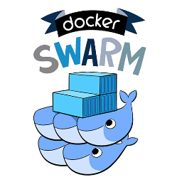
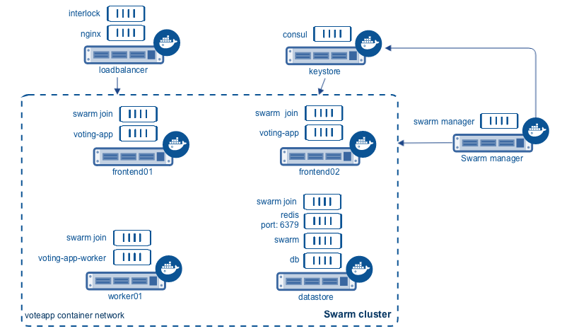

## Deploying a Swarm Application


### Docker Swarm

* Standard since Docker 1.12 <!-- .element: class="img-right" -->
* Manage containers across multiple machines
   * Scaling services
   * Healthchecks
   * Load balancing


### Docker Swarm

* Two types of machines or _nodes_
   * 1 or more _manager_ nodes
   * 0 or more _worker_ nodes
* Managers control global state of cluster
   * Raft Consensus Algorithm
   * If one manager fails, any other should take over
                      
                    




### Setting Up a Cluster
* Need to: <!-- .element: class="fragment" data-fragment-index="0" -->
   * provision machines
   * set up router(s)
   * set up security groups
* Preferable to use automation tools: <!-- .element: class="fragment" data-fragment-index="1" -->
   * Chef
   * Puppet
   * Terraform
   * Ansible


### Create a Cluster
```
cat ~/credentials.txt
source ~/os-training.catalyst.net.nz-openrc.sh
<enter os training password from ~/credentials.txt>

$ cd ~/docker-introduction/ansible
$ ansible-playbook -i cloud-hosts -K -e suffix=-$( hostname ) \
    create-swarm-hosts.yml
```

* This will do stuff for while, good time for some coffee


### Create Swarm
```
ssh manager<TAB><ENTER>
docker swarm init
```
<asciinema-player autoplay="1" loop="loop"  font-size="medium" speed="1" theme="solarized-light" src="asciinema/asciicast-120530.json" cols="107" rows="12"></asciinema-player>

* Copy the `docker swarm join ...` command from the output


### Join Worker Nodes
* Paste the command from the manager node into terminal on each worker node
* Repeat this for `worker2`

```
ssh worker1<TAB><ENTER>
docker swarm join --token $TOKEN  192.168.99.100:2377
```
<asciinema-player autoplay="1" loop="loop"  font-size="medium" speed="1" theme="solarized-light" src="asciinema/asciicast-120531.json" cols="107" rows="10"></asciinema-player>


### Check Nodes
```
docker node ls
```
<asciinema-player autoplay="1" loop="loop"  font-size="medium" speed="1"
    theme="solarized-light" src="asciinema/asciicast-120532.json" cols="107" rows="6"></asciinema-player>


### Swarm Stack File
* Service description <!-- .element: class="fragment" data-fragment-index="0" -->
* YAML format <!-- .element: class="fragment" data-fragment-index="1" -->
* Similar to file used for <!-- .element: class="fragment" data-fragment-index="2" -->`docker-compose`
* A few differences <!-- .element: class="fragment" data-fragment-index="3" -->
   * No <!-- .element: class="fragment" data-fragment-index="4" -->`build` option
   * No shared volumes <!-- .element: class="fragment" data-fragment-index="5" -->

<!-- .element: style="width:40%;float:left;"  -->

```
# stack.yml
version: "3.3" 
services:
  db:
    image: postgres:9.4
    .
    .
  redis:
    image: redis:latest
    deploy:
      replicas: 3

  vote:
    image: vote:latest
    depends_on:
      - redis
      - db
     deploy:
      replicas: 6
      update_config:
         delay: 5s
         parallelism: 1
```
<!-- .element: style="float:left;width:50%;height:80%;font-size:11pt;"  -->


### Deploying the Voting App
* Upload `docker-stack.yml` to manager node
```
cd ~/example-voting-app
scp docker-stack.yml manager-TRAININGPC:~/
```


### Deploy Application
```
docker stack deploy -c docker-stack.yml vote
```
<script  data-autoplay="1" data-loop="1" data-size="small" data-speed="1" type="text/javascript" src="https://asciinema.org/a/120533.js" id="asciicast-120533" async></script>


### Monitor Deploy Progress

    watch docker stack ps vote

    watch docker service ls
  


### Try Out the Voting App
<dl>
  <dt><a
    href="http://voting.app:5000">http://voting.app:5000</a></dt>           
  <dd>To vote</dd>
  <dt><a
    href="http://voting.app:5001">http://voting.app:5001</a></dt>
  <dd>To see results</dd>
  <dt><a
    href="http://voting.app:8080">http://voting.app:8080</a></dt>
  <dd>To visualise running containers</dd>
</dl>


### Scale Services
```
$ docker service scale vote_vote=3
```
* Look at the changes in the <a href="http://voting.app:8080">visualizer</a>


### Update a Service
```
$ docker service update --image YOURNAME/vote:v2 vote_vote
```
<asciinema-player autoplay="1" loop="loop"  font-size="medium" speed="1"
    theme="solarized-light" src="asciinema/asciicast-120564.json" cols="146"
    rows="10"></asciinema-player>

* Now go to the <a href="http://voting.app:5000">voting app</a> and verify the change


### Drain a Node
```
docker node update --availability drain worker1
```
* Sometimes necessary to take host offline
   * Planned maintenance
   * Patching vulnerabilities
   * Resizing host
* Prevents node from receiving new tasks
* Manager stops tasks running on node and launches replicas on active nodes


### Return Node To Service

```
docker node update --availability active worker1
```

* during a service update to scale up
* during a rolling update
* when you set another node to Drain availability
* when a task fails on another active node


### Tear Down Your Cluster

When you're done playing around with the voting app,
please run the following
```                        
$ ansible-playbook -i cloud-hosts -K  -e suffix=-$( hostname ) \ 
   remove-swarm-hosts.yaml
```
<!-- .element: class="stretch"  -->


### Summary

* Created a cluster with a cloud provider using ansible
   * 1 manager node
   * 2 worker nodes
* Deployed microservice for voting app in Docker Swarm
* Scaled service from 2 to 3 services
* Rolling-Updated image

