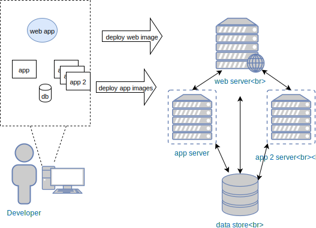

## Designing Containerised Applications

### Developing Applications
* Applications can consist of many components <!-- .element: class="fragment" data-fragment-index="0" -->   <!-- .element: class="img-right" style="width:30%;" -->
   * Web server (nginx, apache)
   * Database (sql, nosql)
   * Message Queue 
   * Your application
* <!-- .element: class="fragment" data-fragment-index="1" -->Typically spread across cluster of machines 

### Development vs Production

* Ideal scenario development environment identical to production <!-- .element: class="fragment" data-fragment-index="0" -->
* In practice this is often difficult to achieve  <!-- .element: class="fragment" data-fragment-index="1" -->
   * Limited CPU of dev machines <!-- .element: class="fragment" data-fragment-index="2" --> <!-- .element: class="img-right" style="width:40%;" -->
   * Cost of machines <!-- .element: class="fragment" data-fragment-index="3" -->
   * Compromise is to develop everything in single VM <!-- .element: class="fragment" data-fragment-index="4" --> 

### Pitfalls of Single VM Development
* Single VM development creates blindspot <!-- .element: class="fragment" data-fragment-index="0" -->
* Developers can make false assumptions about <!-- .element: class="fragment" data-fragment-index="1" -->
   * Which config files on which machines <!-- .element: class="fragment" data-fragment-index="2" -->
   * Which dependency libraries present on machines <!-- .element: class="fragment" data-fragment-index="3" -->
* Difficult to scale individual services <!-- .element: class="fragment" data-fragment-index="4" -->
   * web server, message queue
   * application components (microservices vs. monolith)
* Can lead to unpredictable behaviour when application is deployed to production <!-- .element: class="fragment" data-fragment-index="5" -->

### Misconception About Docker Containers

>I'll just put my entire application into a Docker container and run it that way

Common mistake to try and treat Docker containers like traditional VMs <!-- .element: class="fragment" data-fragment-index="0" -->

### Designing Containerised Applications
* Containerised application should be <!-- .element: class="fragment" data-fragment-index="0" -->_smallest executable unit_
  * Single executable runner only <!-- .element: class="fragment" data-fragment-index="1" -->
  * Single process per container <!-- .element: class="fragment" data-fragment-index="2" -->
  * Single component of your application <!-- .element: class="fragment" data-fragment-index="3" -->
* No stored <!-- .element: class="fragment" data-fragment-index="4" -->_state_
  * Do not store entire DB in a container <!-- .element: class="fragment" data-fragment-index="5" -->
  * Do not rely on files or other persistant files or data in container <!-- .element: class="fragment" data-fragment-index="6" -->

### Containerise Application Components
* Each component is self-contained  <!-- .element: class="img-right" style="width:50%;" -->
   * dependencies
   * configuration
* Components can be independently 
   * Started/Stopped
   * Updated
   * Scaled
* Brings us closer to production environment

### What's the Catch?
>Your Docker thingy still isn't <!-- .element: class="fragment" data-fragment-index="0" -->_exactly_ like production!

> Our application(s) are not deployed as Docker containers <!-- .element: class="fragment" data-fragment-index="1" -->
