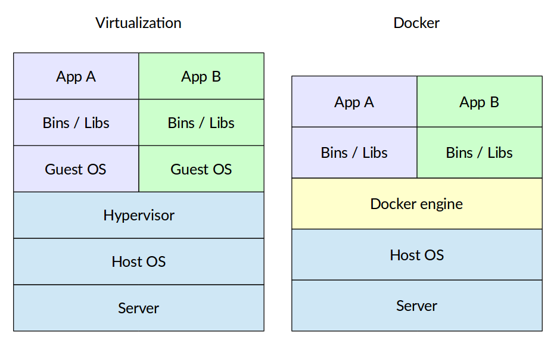

## Introduction to Containers

### What is containerisation?

* A type of virtualization
* Differences from traditional VMs
   * Does not replicate entire OS, just bits needed for application
   * Run natively on host
* Key benefits:
   * More lightweight than VMs
   * Efficiency gains in storage, CPU
   * Portability

Note: Same application container can run on any system or cloud.

### Lightweight <!-- .slide: class="image-slide" --> 

### Benefits: Resources

* Containers share a kernel
* Use less CPU than VMs
* Less storage. Container image only contains:
   * executable
   * application dependencies

### Benefits: Decoupling

* Application stack not coupled to host machine
* Scale and upgrade services independently
* Treat services like cattle instead of pets 

### Benefits: Developer Workflow

* Easy to distribute
* Developers can wrap application with libs and dependencies as a single package 
* Easy to move code from development environments to production in easy and replicable fashion 

